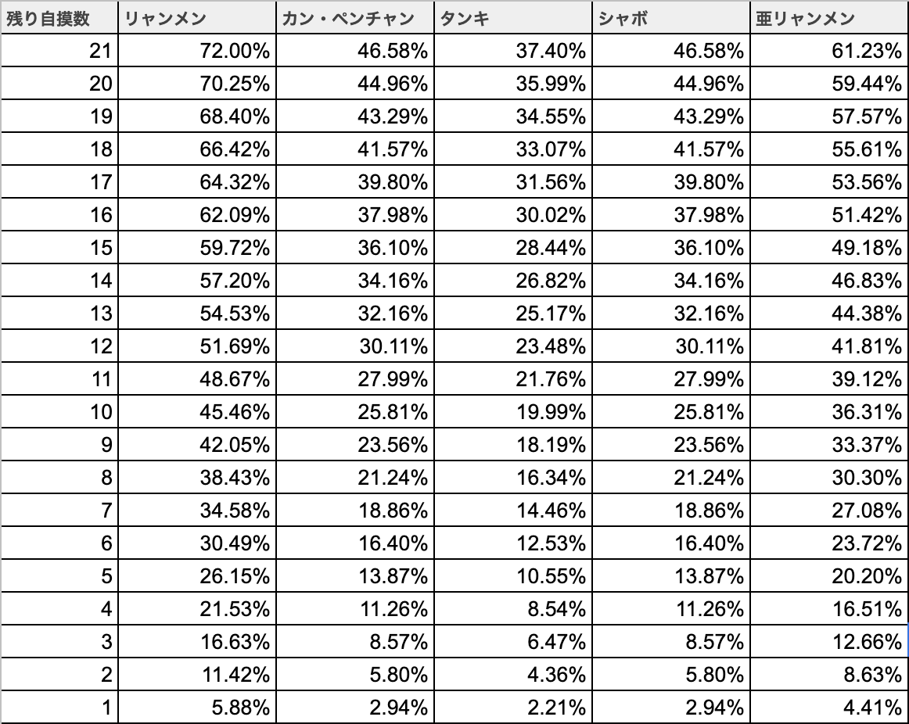

<style>
  .slidev-layout {
    h2 {
      font-size: 1.3rem !important;
      font-weight: 500;
      margin-bottom: 10px;
    }

    h3 {
      @apply text-warm-gray-500;
      font-weight: 500;
      opacity: 1 !important;
    }

    h1 + p + h2 {
      margin-top: 1rem;
    }

    img + h2, pre + h2 {
      margin-top: 1rem;
    }

    pre.slidev-code {
      @apply bg-warm-gray-700;

      .line {
        @apply text-warm-gray-100;
      }
      .token.number {
        @apply text-blue-300;
      }
    }

    table {
      @apply text-xs;
      td, th {
        padding: 7px 10px;
      }
      th {
        @apply bg-warm-gray-200 font-bold text-warm-gray-500;
      }
    }
  }
</style>

---
layout: center
class: text-white bg-warm-gray-900
---


---
layout: image-right
class: text-warm-gray-700 bg-warm-gray-100
---

<style>
.slidev-page-3 {
  h1 {
    display: flex;
    align-items: center;
  }

  h2 {
    font-weight: bold;
    margin-top: 10px !important;
    font-size: 1rem !important;
  }

  .me {
    width: 40px;
    height: 40px;
    display: inline-block;
    border-radius: 50%;
    background-image: url(images/me.jpg);
    background-repeat: no-repeat;
    background-size: 60px;
    background-position: center center;
    margin-right: 5px;
  }

  .sns {
    font-size: 0.8rem;
    margin-right: 5px;

    a {
      @apply text-warm-gray-500;
      margin-right: 15px;
    }
  }

  ul {
    font-size: 0.9rem;
    margin-bottom: 10px !important;
  }
}
</style>

# <div class="me" /> さとしのすけ

自己紹介

<div class="sns">

<uil-github class="inline-block text-warm-gray-500" /> [8823-scholar](https://twitter.com/8823scholar)
<uil-twitter class="inline-block text-warm-gray-500" /> [8823scholar](https://github.com/8823-scholar)
<uil-instagram class="inline-block text-warm-gray-500" /> [8823scholar](https://www.instagram.com/8823scholar/)

</div>

## エンジニア歴: 16年(2005年〜)

* ガラケー公式サイト開発
* ソーシャルゲーム、スマホゲーム開発
* WEBシステム、アプリ開発

## 使用言語

* ◎ TypeScript
* ◎ Ruby
* ◎ Golang
* ◎ PHP
* ◯  C++
* ◯  C#

<!--
aaaaa
-->

---
layout: image-right
class: text-warm-gray-700 bg-warm-gray-100
---

# <uil-youtube class="inline-block" /> Now Coding;

チャンネル紹介

プログラミングを通して、  
「検証したり」「遊んだり」「作ったり」  
するチャンネルです。

プログラミング解説もするよ！

<div class="text-center mt-15">
  
</div>

---
layout: cover
background: ./images/background1.jpg
---

<h1 class="text-center">
  <uim-check-circle class="inline-block align-bottom text-warm-gray-50" />
  検証!
</h1>

<div class="text-center text-5xl p-5 leading-normal">
  さとしのすけのリーチ成功率は<br />本当に低いのか？！
</div>

---
layout: image-right
image: ./images/background2.jpg
class: text-warm-gray-700 bg-warm-gray-100
---

# <uil-question-circle class="inline-block" /> リーチってなんだ？

麻雀の話

## UNOで言う所の「ウノ！」

<uil-check-circle class="inline-block text-warm-gray-500" /> あと一つであがりだよ！という宣言

<uil-check-circle class="inline-block text-warm-gray-500" /> 麻雀では、宣言しても、しなくてもいい

<uil-check-circle class="inline-block text-warm-gray-500" /> 宣言すると、得点が上がる

<uil-check-circle class="inline-block text-warm-gray-500" /> 現代麻雀では、リーチは最強の役

<uil-check-circle class="inline-block text-warm-gray-500" /> その成功率を調べたい！

---
layout: image-right
image: ./images/background2.jpg
class: text-warm-gray-700 bg-warm-gray-100
---

# <uil-question-circle class="inline-block" /> なんで調べるの？

さとしのすけは麻雀が弱いって話

<uil-check-circle class="inline-block text-warm-gray-500" /> さとしのすけはとにかく麻雀が弱い


<uil-check-circle class="inline-block text-warm-gray-500" /> えげつないほど負けまくっている

<uil-question-circle class="inline-block text-warm-gray-500" /> どうしてこんなに負けているのか？

<uil-exclamation-circle class="inline-block text-warm-gray-500" /> リーチ成功率が低い気がする

<uil-check-circle class="inline-block text-warm-gray-500" /> ならば調べてみよう！

---
layout: image-right
image: ./images/tenho.png
class: text-warm-gray-700 bg-warm-gray-100
---

# <uil-search class="inline-block" /> 調査方法

リーチ成功率を調査する

<uil-check-circle class="inline-block text-warm-gray-500" /> オンライン麻雀ゲーム「[天鳳](https://tenhou.net/) 」を利用

<uil-check-circle class="inline-block text-warm-gray-500" /> 天鳳では牌譜をダウンロード可能

<uil-check-circle class="inline-block text-warm-gray-500" /> 牌譜を解析して、リーチ成功率を調査

<h2><uil-calculator class="inline-block" /> 計算方法</h2>

<div class="text-2xl font-bold text-center">
  リーチ成功回数 / リーチ回数<br />
  <span class="write-vertical-right">=</span><br />
  リーチ成功率
</div>

---
layout: image-right
image: ./images/background3.jpg
class: text-warm-gray-700 bg-warm-gray-100
---

# <uil-laptop class="inline-block" /> プログラミング

用意したもの

## <uil-file-alt class="inline-block" /> 牌譜ダウンローダー

* 手動で一つ一つダウンロードするのは大変
* 全ての牌譜をダウンロードする
* 不要な負荷をかけないように配慮
* ID指定でダウンロードできるように

## <uil-file-alt class="inline-block" /> リーチカウンター

* ダウンロードした牌譜を解析
* リーチ回数と、リーチ成功回数を集計する
* ID指定で集計できるように

---
layout: cover
background: ./images/background1.jpg
---

<h1 class="text-center">
  <uim-check-circle class="inline-block text-warm-gray-50" />
  仮説
</h1>

<div class="text-center text-5xl p-5 leading-normal">
  リーチ成功率を仮説してみる
</div>

---
layout: image-right
image: ./images/background4.jpg
class: text-warm-gray-700 bg-warm-gray-100
---

# <uil-bolt class="inline-block" /> 仮説を立てる

ざっくりと要素を確認

## <uil-check-circle class="inline-block text-warm-gray-500" /> 麻雀牌の種類: 全34種


## <uil-check-circle class="inline-block text-warm-gray-500" /> 麻雀牌の総数

<div class="text-center mb-5 mt-5 text-3xl font-bold">
  34種類 ×  各4枚
  =
  136枚
</div>

---
layout: image-right
image: ./images/background4.jpg
class: text-warm-gray-700 bg-warm-gray-100
---

# <uil-bolt class="inline-block" /> 仮説を立てる

ざっくりと要素を確認

## <uil-check-circle class="inline-block text-warm-gray-500" /> 待ちの種類


---
layout: image-right
image: ./images/background4.jpg
class: text-warm-gray-700 bg-warm-gray-100
---

# <uil-bolt class="inline-block" /> 仮説を立てる

自摸できる確率を予測

## <uil-check-circle class="inline-block text-warm-gray-500" /> 山牌内の待牌の割合

```go
リャンメン(2種*4枚=8枚) = 8 / 136 = 0.058...
カンチャン(1種*4枚=4枚) = 4 / 136 = 0.029...
ペンチャン(1種*4枚=4枚) = 4 / 136 = 0.029...
シャンポン(2種*2枚=4枚) = 4 / 136 = 0.029...
タンキ(1種*3枚=3枚) = 3 / 136 = 0.022...
```

## <uil-check-circle class="inline-block text-warm-gray-500" /> 牌数から待牌の数(期待値)を導ける

| 状況 | 残り牌数 | 待牌数(リャンメン) |
| - | - | - |
| 開始直後 | 70枚 | 約4枚 |
| 中盤 | 35枚 | 約2枚 |
| 終盤 | 15枚 | 約1枚 |

---
layout: image-right
image: ./images/background4.jpg
class: text-warm-gray-700 bg-warm-gray-100
---

# <uil-bolt class="inline-block" /> 仮説を立てる

自摸できる確率を予測

## <uil-check-circle class="inline-block text-warm-gray-500" /> 自摸できる確率

<div class="text-center mb-5 mt-5 text-xl font-bold">
  100% - 自摸できない確率
</div>

## <uil-check-circle class="inline-block text-warm-gray-500" /> 自摸できない確率

<p class="text-warm-gray-500 text-xs">
  「待ち牌以外を引く確率」を自摸数分だけ累乗すればいい。<br />
  牌山の多寡に関わらず「期待する牌が存在する確率」は一定のはず。<br />
</p>
<p class="text-warm-gray-500 text-xs">
  a = 待ち牌数(最大数)<br />
  n = 残り自摸数<br />
</p>

<div class="text-center mb-5 mt-5 text-xl font-bold">

  $$
    (1 - (\frac{a}{136}))^n
  $$

</div>

---
layout: image-right
image: ./images/background4.jpg
class: text-warm-gray-700 bg-warm-gray-100
---

# <uil-bolt class="inline-block" /> 仮説を立てる

自摸できる確率を予測

## <uil-check-circle class="inline-block text-warm-gray-500" /> 自摸できる確率表: 全平均 <span class="text-blue-gray-400">約31%</span>



---
layout: image-right
image: ./images/background4.jpg
class: text-warm-gray-700 bg-warm-gray-100
---

# <uil-bolt class="inline-block" /> 仮説を立てる

トータルの成功率を予測

## <uil-check-circle class="inline-block text-warm-gray-500" /> 麻雀は4人で競うゲーム

* 他プレイヤーが降りてしまう
* 他プレイヤーが押してくる
* 他プレイヤーが上がってしまう
* 他プレイヤーの手詰まり

## <uil-check-circle class="inline-block text-warm-gray-500" /> さとしのすけの予測

<div class="text-center text-xl font-bold">
  <div class="text-base mb-5">
    自分都合: 31%<br />
    他都合: +10%(勘)<br />
  </div>

  リーチ成功率 = 40%
</div>

---
layout: image-right
image: ./images/background3.jpg
class: text-warm-gray-700 bg-warm-gray-100
---

# <uil-laptop class="inline-block align-bottom" /> ダウンロード実行

---
layout: image-right
image: ./images/background3.jpg
class: text-warm-gray-700 bg-warm-gray-100
---

# <uil-laptop class="inline-block align-bottom" /> 集計実行

## <uil-calculator class="inline-block" /> 全体集計

```bash
$ go run calc.go
ゲーム数: 13473
リーチ回数: 89961
リーチ成功回数: 44469
リーチ成功率: 49.43
```

## <uil-calculator class="inline-block" /> さとしのすけ集計

```bash
$ go run calc.go IDXXXXXXXX-XXXXXXXX
ゲーム数: 117
リーチ回数: 88
リーチ成功回数: 52
リーチ成功率: 59.09
```

---
layout: image-right
image: ./images/background3.jpg
class: text-warm-gray-700 bg-warm-gray-100
---

<style>
.slidev-page-12 {
  table {
    @apply text-xs;
    thead {
      display: none;
    }
    td {
      padding: 7px 10px;
    }
  }
}
</style>

# <uil-laptop class="inline-block align-bottom" /> 集計実行

## <uil-calculator class="inline-block" /> 全体集計

| | |
| - | - |
| ゲーム数 | 13473 |
| リーチ回数 | 89961 |
| リーチ成功回数 | 44469 |

<div class="text-center mb-5 mt-2 text-3xl font-bold">
  49.43%
</div>

## <uil-calculator class="inline-block" /> さとしのすけ集計

| | |
| - | - |
| ゲーム数 | 117 |
| リーチ回数 | 88 |
| リーチ成功回数 | 52 |

<div class="text-center mb-5 mt-2 text-3xl font-bold">
  59.09%
</div>

